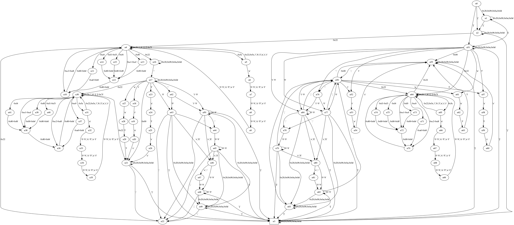

# json-validator

Sample results of `stack build --file-watch --exec 'json-validator-exe --regress allocated:iters +RTS -T'`:

    benchmarking aeson/testEvent
    time                 35.81 μs   (35.37 μs .. 36.29 μs)
                         0.997 R²   (0.996 R² .. 0.998 R²)
    mean                 35.89 μs   (35.19 μs .. 36.62 μs)
    std dev              2.527 μs   (2.126 μs .. 3.165 μs)
    allocated:           1.000 R²   (1.000 R² .. 1.000 R²)
      iters              84076.995  (84046.169 .. 84110.075)
      y                  -4390.710  (-49432.309 .. 42078.127)
    variance introduced by outliers: 72% (severely inflated)

    benchmarking json-validator/Automaton/testEvent
    time                 15.77 μs   (15.69 μs .. 15.85 μs)
                         1.000 R²   (1.000 R² .. 1.000 R²)
    mean                 15.78 μs   (15.70 μs .. 15.93 μs)
    std dev              372.2 ns   (244.5 ns .. 611.7 ns)
    allocated:           0.987 R²   (0.979 R² .. 0.991 R²)
      iters              455.387    (445.770 .. 465.310)
      y                  -279.162   (-30354.459 .. 29514.381)
    variance introduced by outliers: 24% (moderately inflated)

    benchmarking json-validator/Automaton/testEvent[1000]/r0
    time                 15.11 ms   (14.92 ms .. 15.27 ms)
                         0.999 R²   (0.998 R² .. 1.000 R²)
    mean                 15.14 ms   (15.01 ms .. 15.44 ms)
    std dev              485.3 μs   (197.3 μs .. 812.6 μs)
    allocated:           1.000 R²   (1.000 R² .. 1.000 R²)
      iters              519164.640 (519159.284 .. 519169.315)
      y                  76.594     (24.915 .. 142.398)
    variance introduced by outliers: 11% (moderately inflated)

    benchmarking json-validator/Automaton/testEvent[1000]/evalList
    time                 14.64 ms   (14.35 ms .. 14.96 ms)
                         0.997 R²   (0.993 R² .. 0.999 R²)
    mean                 16.38 ms   (15.67 ms .. 18.03 ms)
    std dev              2.583 ms   (1.217 ms .. 4.315 ms)
    allocated:           0.998 R²   (0.995 R² .. 0.999 R²)
      iters              545127.609 (536060.358 .. 551642.783)
      y                  -21135.760 (-146360.216 .. 149067.785)
    variance introduced by outliers: 70% (severely inflated)

    benchmarking json-validator/Automaton/testEvent[1000]/parList
    time                 56.59 ms   (47.24 ms .. 63.58 ms)
                         0.945 R²   (0.879 R² .. 0.981 R²)
    mean                 55.94 ms   (51.96 ms .. 62.55 ms)
    std dev              8.951 ms   (6.236 ms .. 13.37 ms)
    allocated:           0.971 R²   (0.919 R² .. 0.991 R²)
      iters              631059.552 (560143.079 .. 676428.193)
      y                  -178722.424 (-562994.578 .. 362095.491)
    variance introduced by outliers: 57% (severely inflated)

    benchmarking json-validator/Automaton/testEvent[1000]/parListChunk 2
    time                 53.46 ms   (51.72 ms .. 55.53 ms)
                         0.996 R²   (0.991 R² .. 0.999 R²)
    mean                 52.95 ms   (51.76 ms .. 54.38 ms)
    std dev              2.556 ms   (1.841 ms .. 3.515 ms)
    allocated:           0.982 R²   (0.960 R² .. 0.994 R²)
      iters              915907.077 (844489.595 .. 981170.471)
      y                  -31697.231 (-456629.316 .. 585686.400)
    variance introduced by outliers: 14% (moderately inflated)

    benchmarking json-validator/Automaton/testEvent[1000]/parListChunk 4
    time                 51.76 ms   (49.91 ms .. 53.84 ms)
                         0.996 R²   (0.992 R² .. 0.999 R²)
    mean                 50.34 ms   (49.17 ms .. 51.31 ms)
    std dev              1.851 ms   (1.204 ms .. 2.840 ms)
    allocated:           0.994 R²   (0.988 R² .. 1.000 R²)
      iters              843712.747 (797585.954 .. 889750.123)
      y                  -186757.846 (-618384.038 .. 260682.549)

    benchmarking json-validator/Automaton/testEvent[1000]/parListChunk 8
    time                 45.68 ms   (43.18 ms .. 49.58 ms)
                         0.987 R²   (0.973 R² .. 0.999 R²)
    mean                 46.91 ms   (45.62 ms .. 49.80 ms)
    std dev              3.780 ms   (1.918 ms .. 6.024 ms)
    allocated:           0.995 R²   (0.990 R² .. 0.999 R²)
      iters              787345.020 (747268.360 .. 830759.911)
      y                  -120374.505 (-555416.756 .. 246808.390)
    variance introduced by outliers: 27% (moderately inflated)

    benchmarking json-validator/Automaton/testEvent[1000]/parListChunk 16
    time                 43.97 ms   (41.03 ms .. 46.83 ms)
                         0.989 R²   (0.976 R² .. 0.998 R²)
    mean                 44.74 ms   (43.17 ms .. 48.40 ms)
    std dev              4.021 ms   (1.611 ms .. 6.877 ms)
    allocated:           0.995 R²   (0.990 R² .. 1.000 R²)
      iters              764511.437 (731638.181 .. 806344.786)
      y                  -109744.352 (-514073.266 .. 212947.519)
    variance introduced by outliers: 34% (moderately inflated)

    benchmarking json-validator/Automaton/testEvent[1000]/parListChunk 100
    time                 44.59 ms   (38.58 ms .. 50.04 ms)
                         0.955 R²   (0.912 R² .. 0.984 R²)
    mean                 45.88 ms   (43.15 ms .. 49.02 ms)
    std dev              5.918 ms   (4.373 ms .. 8.557 ms)
    allocated:           0.982 R²   (0.949 R² .. 0.996 R²)
      iters              889069.820 (817506.222 .. 958628.977)
      y                  -143583.648 (-771283.771 .. 606544.060)
    variance introduced by outliers: 48% (moderately inflated)

